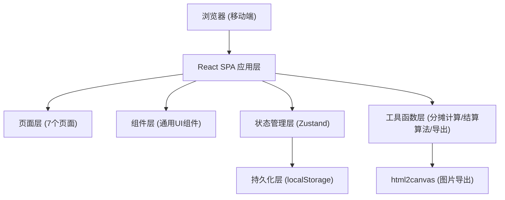
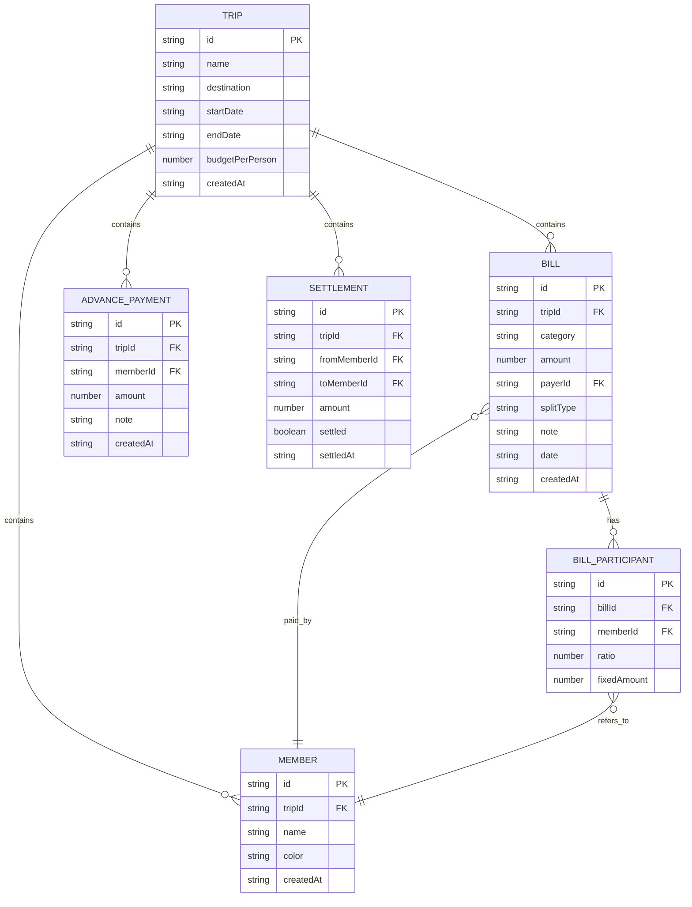

## 1. 架构设计



## 2. 技术说明

- **前端框架**：React@18 + TypeScript
- **构建工具**：Vite@5
- **样式方案**：Tailwind CSS@3
- **状态管理**：Zustand（含persist中间件实现localStorage持久化）
- **路由**：React Router DOM@6
- **图标库**：Lucide React
- **图片导出**：html2canvas
- **图表**：纯CSS/SVG实现饼图（避免引入重型图表库）
- **后端**：无（纯前端应用）
- **数据库**：localStorage浏览器本地存储

## 3. 路由定义

| 路由 | 页面 | 说明 |
|-------|---------|------|
| /trips | 行程页面 | 旅行列表、新建旅行、切换当前旅行 |
| /bills | 账单页面 | 账单列表、添加账单、日期筛选 |
| /members | 成员页面 | 成员列表、添加成员、预付款登记 |
| /settlement | 结算页面 | 转账方案、结清标记 |
| /budget | 预算页面 | 预算设置、超支提醒 |
| /statistics | 统计页面 | 消费饼图、数据统计 |
| /export | 导出页面 | 图片导出、数据备份恢复 |
| / | 重定向到 /trips | 默认路由 |

## 4. 数据模型

### 4.1 数据模型定义



### 4.2 TypeScript 类型定义

```typescript
// 账单分类
type BillCategory = 'food' | 'transport' | 'ticket' | 'hotel' | 'other';

// 分摊方式
type SplitType = 'equal' | 'ratio' | 'fixed';

interface Trip {
  id: string;
  name: string;
  destination: string;
  startDate: string;
  endDate: string;
  budgetPerPerson: number;
  createdAt: string;
}

interface Member {
  id: string;
  tripId: string;
  name: string;
  color: string;
  createdAt: string;
}

interface AdvancePayment {
  id: string;
  tripId: string;
  memberId: string;
  amount: number;
  note: string;
  createdAt: string;
}

interface BillParticipant {
  id: string;
  billId: string;
  memberId: string;
  ratio: number;      // 按比例分摊时使用（0-1）
  fixedAmount: number; // 固定金额分摊时使用
}

interface Bill {
  id: string;
  tripId: string;
  category: BillCategory;
  amount: number;
  payerId: string;
  splitType: SplitType;
  note: string;
  date: string;
  createdAt: string;
  participants: BillParticipant[];
}

interface Settlement {
  id: string;
  tripId: string;
  fromMemberId: string;
  toMemberId: string;
  amount: number;
  settled: boolean;
  settledAt?: string;
}

interface AppState {
  trips: Trip[];
  currentTripId: string | null;
  members: Member[];
  bills: Bill[];
  advancePayments: AdvancePayment[];
  settlements: Settlement[];
}
```

## 5. 核心算法

### 5.1 分摊计算算法
- **均分（equal）**：账单金额 ÷ 参与人数，每人应付相同金额
- **按比例（ratio）**：账单金额 × 各人比例，比例之和应为1
- **固定金额（fixed）**：每人应付预设的固定金额，总和应等于账单金额

### 5.2 最优结算算法
1. 计算每个成员的净余额（已付总额 + 预付款 - 应付总额）
2. 正数表示应收，负数表示应付
3. 使用贪心算法匹配最大债权人和最大债务人，最小化转账次数
4. 生成最少笔数的转账方案

### 5.3 数据持久化
- Zustand persist中间件自动同步到localStorage
- 存储key: `trip-aa-tracker-data`
- 支持导出JSON文件和导入恢复

## 6. 项目结构

```
src/
├── components/          # 通用UI组件
│   ├── BottomNav.tsx    # 底部导航栏
│   ├── BillCard.tsx     # 账单卡片
│   ├── MemberAvatar.tsx # 成员头像
│   ├── CategoryIcon.tsx # 分类图标
│   ├── EmptyState.tsx   # 空状态
│   ├── Modal.tsx        # 通用弹窗
│   └── PieChart.tsx     # 饼图组件
├── pages/               # 页面组件
│   ├── TripsPage.tsx    # 行程页面
│   ├── BillsPage.tsx    # 账单页面
│   ├── MembersPage.tsx  # 成员页面
│   ├── SettlementPage.tsx # 结算页面
│   ├── BudgetPage.tsx   # 预算页面
│   ├── StatisticsPage.tsx # 统计页面
│   └── ExportPage.tsx   # 导出页面
├── store/               # 状态管理
│   └── useStore.ts      # Zustand store
├── hooks/               # 自定义hooks
│   ├── useCurrentTrip.ts
│   └── useSettlement.ts
├── utils/               # 工具函数
│   ├── calculation.ts   # 分摊/结算计算
│   ├── storage.ts       # 本地存储
│   ├── export.ts        # 导出功能
│   └── id.ts            # ID生成
├── types/               # 类型定义
│   └── index.ts
├── constants/           # 常量配置
│   └── index.ts         # 分类配置、颜色等
├── App.tsx              # 根组件
├── main.tsx             # 入口文件
└── index.css            # 全局样式
```
