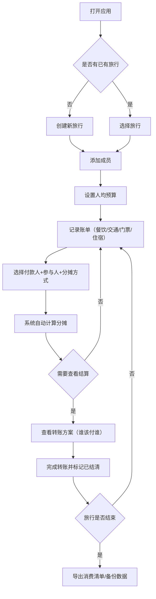

## 1. 产品概述

旅行AA记账是一款纯前端移动端网页应用，专为结伴出游的人群设计，用于在旅行过程中即时记录和分摊各类费用。通过简洁直观的界面，用户可以快速记录消费、自动计算分摊金额、生成结算方案，并支持离线使用和数据导出。

- 核心目标：解决多人旅行中的费用记账和分摊难题，避免旅行结束后的算账纠纷
- 目标用户：结伴出游的朋友、家庭、同事等2人以上的旅行群体
- 核心价值：即时记录、智能分摊、清晰结算、离线可用

## 2. 核心功能

### 2.1 用户角色
本应用无多角色区分，所有使用者拥有相同权限，均可创建旅行、记录账单、管理成员。

### 2.2 功能模块
1. **行程页面**：旅行列表、新建/编辑旅行、切换当前旅行
2. **账单页面**：账单列表、添加/编辑账单、按日期筛选、分类展示
3. **成员页面**：成员列表、添加/编辑/删除成员、登记预付款
4. **结算页面**：自动生成转账方案、谁该付谁、标记已结清
5. **预算页面**：设置人均预算、查看总预算、超支提醒
6. **统计页面**：消费分类饼图、人均消费、分类统计
7. **导出页面**：导出消费清单图片、数据备份恢复

### 2.3 页面详情
| 页面名称 | 模块名称 | 功能描述 |
|-----------|-------------|---------------------|
| 行程页面 | 旅行列表 | 展示所有旅行卡片，显示旅行名称、时间、人数、总消费 |
| 行程页面 | 新建旅行 | 输入旅行名称、开始/结束日期、目的地，创建新旅行 |
| 账单页面 | 账单列表 | 按日期分组展示所有账单，显示金额、付款人、分类 |
| 账单页面 | 添加账单 | 输入金额、选择分类（餐饮/交通/门票/住宿/其他）、选择付款人、选择参与人、选择分摊方式（均分/按比例/固定金额） |
| 账单页面 | 日期筛选 | 按日期范围筛选账单记录 |
| 成员页面 | 成员列表 | 展示所有成员头像、姓名、预付款、已支付金额、应付金额 |
| 成员页面 | 添加成员 | 输入成员姓名、选择头像颜色 |
| 成员页面 | 预付款登记 | 为成员登记预付的公共费用 |
| 结算页面 | 转账方案 | 自动计算最优转账方案，展示谁该给谁转多少钱 |
| 结算页面 | 结清标记 | 将单条转账记录标记为已结清 |
| 预算页面 | 预算设置 | 设置人均预算金额，自动计算总预算 |
| 预算页面 | 超支提醒 | 当消费超过预算时醒目提醒，显示超支比例 |
| 统计页面 | 消费饼图 | 按分类展示消费占比的饼状图 |
| 统计页面 | 数据统计 | 展示总消费、人均消费、笔数、各类别消费明细 |
| 导出页面 | 图片导出 | 生成完整消费清单的长图，可保存到本地 |
| 导出页面 | 数据备份 | 导出JSON备份文件，支持导入恢复数据 |

## 3. 核心流程

用户首次打开应用后，首先创建一个新旅行，然后添加同行成员，设置人均预算。在旅行过程中，每发生一笔费用，用户记录账单（选择付款人、参与人、分摊方式）。系统自动累计各成员的收支情况。需要结算时，进入结算页面查看最优转账方案，完成转账后标记为已结清。旅行结束后可导出消费清单图片或备份数据。

## 4. 用户界面设计

### 4.1 设计风格
- **主色调**：清新旅行绿（#10B981）搭配活力橙（#F59E0B），营造轻松愉快的旅行氛围
- **辅助色**：天蓝色（#3B82F6）用于信息展示，玫红色（#EC4899）用于警告提醒
- **中性色**：深灰（#1F2937）文字、中灰（#6B7280）次要文字、浅灰（#F3F4F6）背景
- **按钮样式**：圆角胶囊形按钮，主色填充，点击有缩放反馈
- **字体**：使用现代无衬线字体，标题加粗，正文清晰易读
- **布局风格**：卡片式布局，底部Tab导航，移动端优先
- **图标风格**：使用线性图标，简洁统一，搭配emoji增加趣味性

### 4.2 页面设计概述
| 页面名称 | 模块名称 | UI元素 |
|-----------|-------------|-------------|
| 行程页面 | 旅行列表 | 卡片堆叠、渐变背景色、旅行日期标签、人数/金额统计徽章、悬浮新建按钮 |
| 账单页面 | 账单列表 | 日期分组标题、分类彩色图标、金额右对齐、付款人头像、滑动删除 |
| 账单页面 | 添加账单 | 底部弹出表单、金额大数字输入、分类快速选择、成员多选卡片 |
| 成员页面 | 成员列表 | 圆形头像（彩色渐变）、姓名、预付款标签、收支明细、添加按钮 |
| 结算页面 | 转账方案 | 箭头指示方向、金额高亮、结清状态切换、已结清灰显 |
| 预算页面 | 预算面板 | 进度条环形图、已用/预算金额对比、超支红色闪烁动画 |
| 统计页面 | 消费饼图 | 带图例的彩色饼图、分类进度条、统计数字卡片 |
| 导出页面 | 导出选项 | 大图标按钮、操作说明、导入拖放区域 |
| 全局 | 底部导航 | 5个Tab图标+文字、当前页面高亮、上滑悬浮效果 |

### 4.3 响应式
- **移动端优先**：以375px宽度为基准设计，自适应到430px、390px等主流手机尺寸
- **触摸优化**：按钮最小点击区域44×44px，列表项高度≥56px，避免误触
- **横屏适配**：横屏时保持内容居中，最大宽度限制在600px以内
- **平板适配**：在平板上显示居中的手机尺寸容器，两侧留白

### 4.4 离线与持久化
- 所有数据使用localStorage持久化存储
- 应用启动时自动从localStorage恢复数据
- 支持导出JSON备份文件和导入恢复
- 支持生成消费清单长图供用户保存
